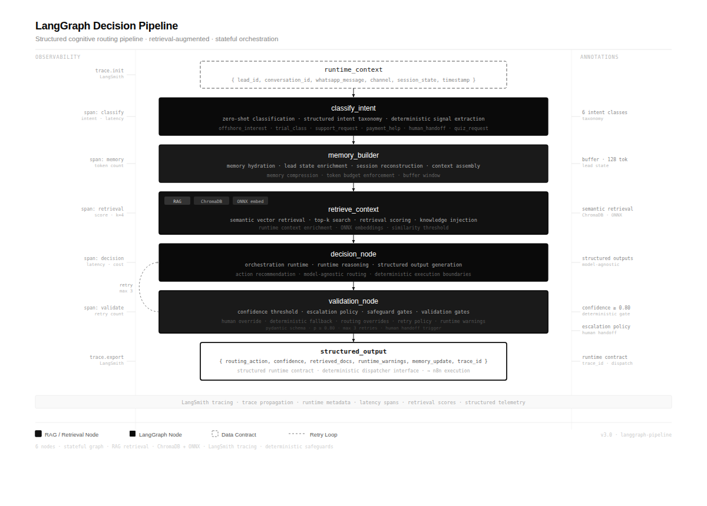
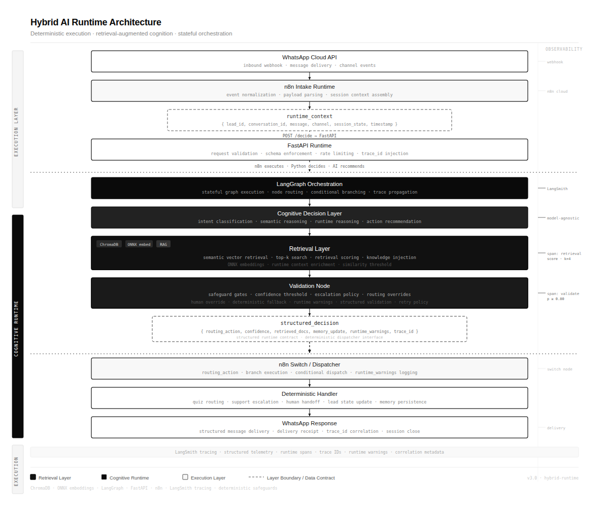
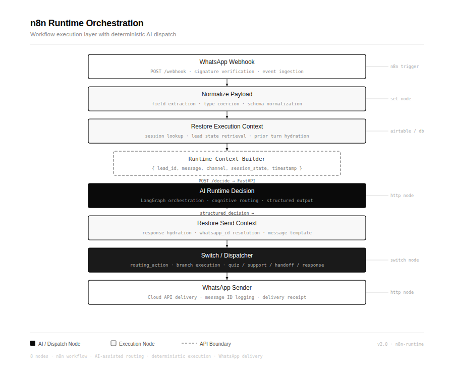
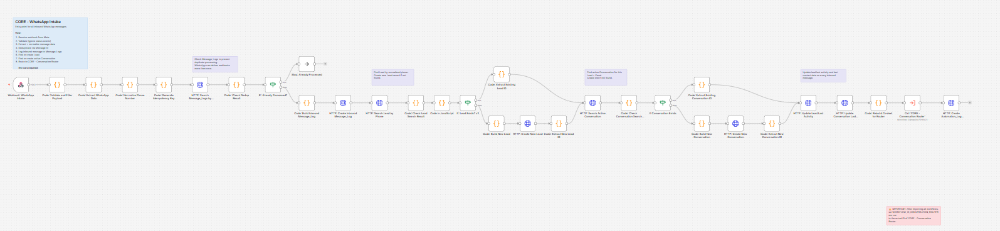
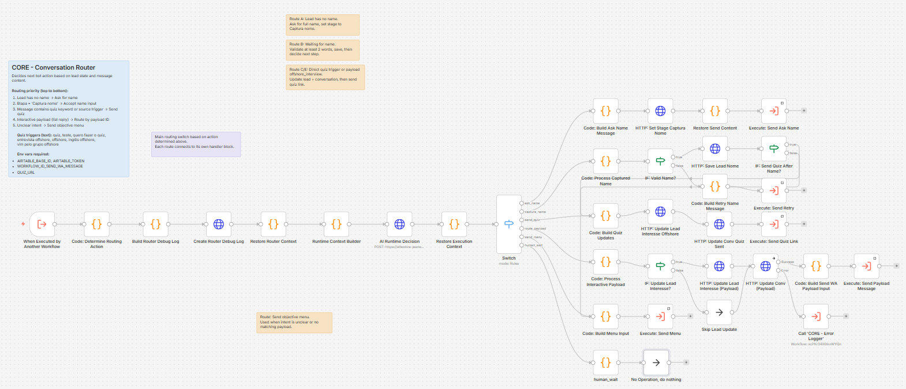
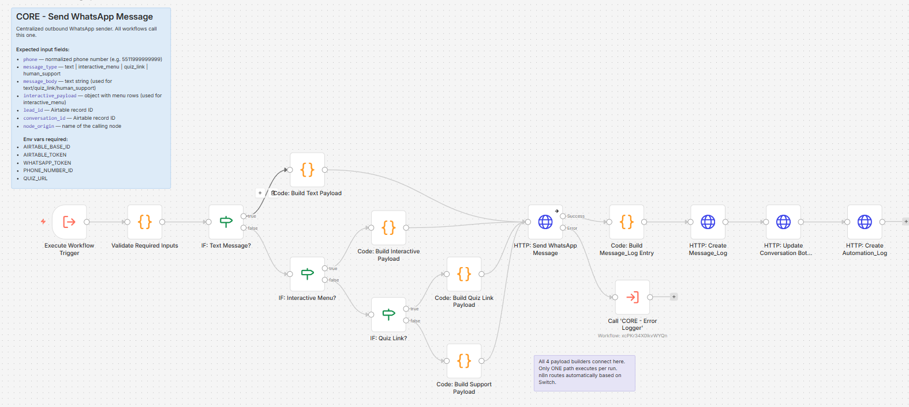
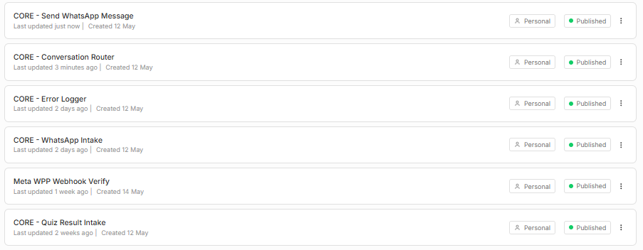
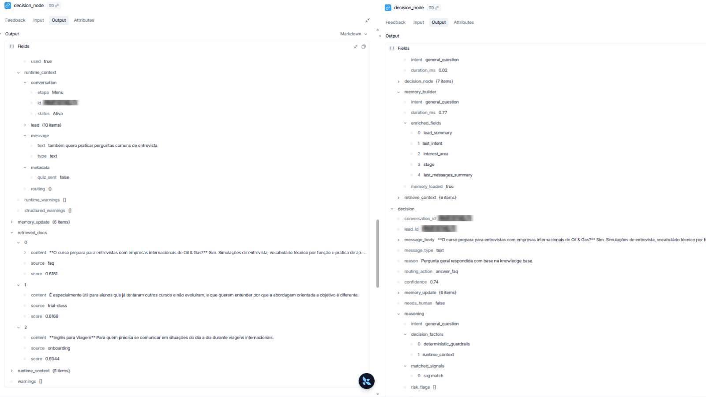
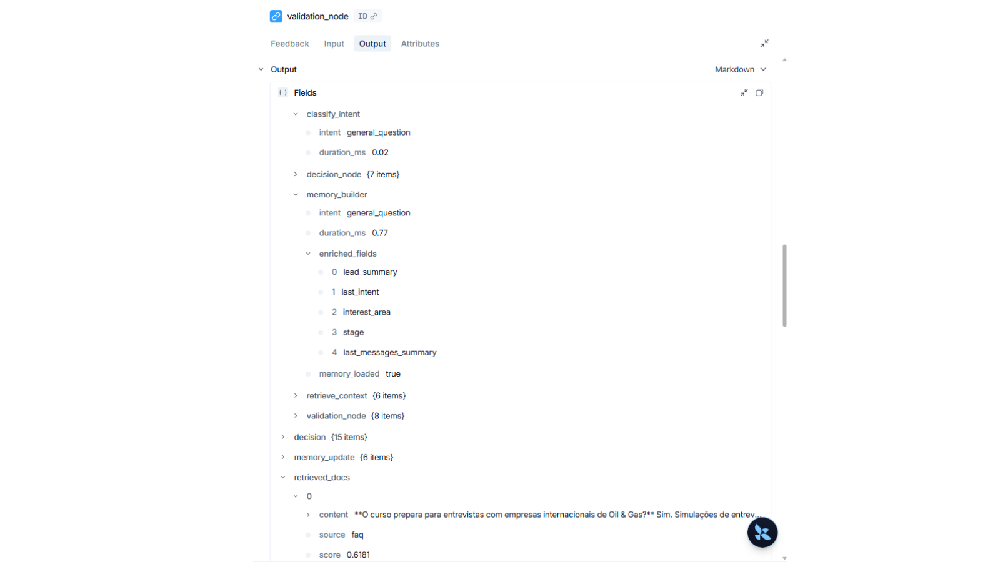

# Hybrid AI WhatsApp Runtime

> Hybrid orchestration runtime for stateful WhatsApp pipelines — structured AI decision engine over a deterministic execution layer.

Stateful AI routing runtime connecting a LangGraph decision pipeline to a n8n execution layer. The AI produces typed routing contracts. n8n executes them.

---

## Architecture

The runtime combines LangGraph orchestration, FastAPI decision APIs, n8n deterministic execution, semantic retrieval, runtime validation, and structured AI routing into a unified hybrid middleware system.

### LangGraph Decision Pipeline



Stateful orchestration with a layered retrieval stage, per-request memory hydration, validation gates that can override AI recommendations, and typed structured outputs at every pipeline boundary.

### Hybrid Runtime Architecture



WhatsApp → n8n → FastAPI → LangGraph. The deterministic execution layer owns side-effects and delivery; the cognitive layer owns routing and confidence. Separation is enforced at the `DecideResponse` contract boundary with runtime dispatching and validation overrides.

### n8n Runtime Orchestration



Workflow runtime execution with payload normalization, runtime context restoration before every AI call, dispatcher routing across modular handlers, and WhatsApp delivery with idempotency enforcement.

### System Overview

```
┌─────────────────────────────────────────────────────────────────┐
│                      EXECUTION LAYER (n8n)                      │
│                                                                 │
│   WhatsApp Cloud API → n8n Intake                               │
│   (validation, idempotency, schema check)                       │
│         │                                                       │
│         │  POST /decide  ──────────────────────────────────┐   │
└─────────┼───────────────────────────────────────────────────┼───┘
          │                                                   │
┌─────────▼───────────────────────────────────────────────────▼───┐
│                   COGNITIVE RUNTIME (Python)                     │
│                                                                 │
│   FastAPI  ──▶  LangGraph Decision Pipeline                     │
│                                                                 │
│      classify_intent      ← keyword + payload pre-classifier    │
│      memory_builder       ← SQLite hydration                    │
│      retrieve_context     ← ChromaDB semantic RAG               │
│      decision_node        ← OpenAI / deterministic fallback     │
│      validation_node      ← confidence gates + business rules   │
│                                                                 │
│      DecideResponse       ← typed routing contract (JSON)       │
└─────────────────────────────────────────────────────────────────┘
          │
┌─────────▼───────────────────────────────────────────────────────┐
│                   EXECUTION LAYER (n8n)                          │
│   routing_action switch → handler → Airtable / WhatsApp         │
└─────────────────────────────────────────────────────────────────┘
```

---

## Design

- **Execution/cognition separation** — `DecideResponse` is the contract. n8n executes. Python decides.
- **AI as recommendation layer** — OpenAI recommends a `routing_action`. `validation_node` is the runtime authority and can override any recommendation.
- **Confidence-gated execution** — hard thresholds route low-confidence decisions to `send_menu` or `human_wait` before leaving the runtime.
- **Deterministic fallback** — rule-based routing produces identical JSON when no API key is available.
- **First-class human escalation** — `needs_human` and `human_wait` are contract fields on every response, not exception paths.
- **Explicit execution context** — `runtime_context` is a typed Pydantic schema on every request. No hidden state, no session globals.

---

## Cognitive Runtime

<!--  -->

```
┌──────────────────┐
│  classify_intent │  keyword + payload pre-classifier
└────────┬─────────┘
         │
┌────────▼─────────┐
│  memory_builder  │  SQLite load → runtime_context hydration
└────────┬─────────┘
         │
┌────────▼─────────┐
│retrieve_context  │  ChromaDB semantic retrieval (ONNX / OpenAI)
└────────┬─────────┘
         │
┌────────▼─────────┐
│  decision_node   │  OpenAI structured output (enum-enforced)
│                  │  temperature=0.1 · retries=2 · timeout=20s
│                  │  fallback: deterministic rule-based routing
└────────┬─────────┘
         │
┌────────▼─────────┐
│ validation_node  │  7 ordered validation gates
│                  │  confidence floors · business rules
│                  │  runtime_warnings[] on every response
└────────┬─────────┘
         │
    DecideResponse  (JSON routing contract)
```

**Confidence thresholds:**

```
< 0.60  →  human_wait  (needs_human=true)
< 0.75  →  send_menu or human_wait (based on action risk)
≥ 0.75  →  routing_action executed as-is
```

**Validation gates (priority order):**

1. `routing_action` enum enforcement
2. Conversation status guard (`Pausada` / `Finalizada` → block)
3. `needs_human` flag enforcement
4. Sensitive intent escalation (payment · billing · support)
5. Duplicate quiz prevention (`quiz_sent` metadata flag)
6. Confidence floor enforcement
7. `message_body` requirement for text responses

---

## Execution Runtime

**n8n is the execution layer. Python is the decision layer. `runtime_context` is the contract between them.**

| Layer | Responsibilities |
|---|---|
| **n8n** | Webhook intake · schema validation · idempotency · routing switch · message dispatch · Airtable writes · error handling |
| **Python** | Intent classification · memory hydration · semantic retrieval · AI decision · confidence validation · human escalation |

| Layer | Owns | Never touches |
|---|---|---|
| n8n | Side-effects, delivery, state writes | Routing logic, confidence, intent |
| Python | Cognition, validation, memory | WhatsApp API, Airtable, delivery |

<!--  -->

---

## Workflow Orchestration

The execution layer runs as deterministic workflows — modular handlers, WhatsApp-native orchestration, routing logic separated from delivery, and a runtime dispatch layer that executes typed contracts from the cognitive runtime.

### Intake Workflow



### Conversation Router



### WhatsApp Sender



### Workflow Modules



---

## LangSmith Runtime Tracing

The runtime supports structured telemetry with per-node trace spans, semantic retrieval inspection, runtime memory hydration visibility, safeguard validation events, deterministic routing traces, structured reasoning capture, and full trace propagation across the pipeline.

```env
LANGSMITH_TRACING=true
LANGSMITH_API_KEY=your_key
LANGSMITH_PROJECT=hybrid-ai-whatsapp-runtime
```

Every LangGraph node is a separate span. State in/out is captured automatically at each boundary. Structured log events are emitted per node — no message content or personal data logged.

| Node | Trace fields |
|---|---|
| `classify_intent` | `intent` · `duration_ms` |
| `memory_builder` | `memory_loaded` · `enriched_fields` · `intent` · `duration_ms` |
| `retrieve_context` | `retrieval_mode` · `retrieved_doc_count` · `top_sources` · `top_scores` · `embedding_provider` · `duration_ms` |
| `decision_node` | `decision_mode` · `routing_action` · `confidence` · `intent` · `retrieved_doc_count` · `duration_ms` |
| `validation_node` | `confidence_before/after` · `routing_action_before/after` · `validation_overrides` · `structured_warning_count` · `needs_human_after` · `duration_ms` |

Each request carries a `trace_id` (`trace_<12hex>`) through the full pipeline — visible in logs, LangSmith spans, and the `DecideResponse`. A structured `RuntimeWarning` taxonomy (`LOW_CONFIDENCE`, `SENSITIVE_INTENT`, `DUPLICATE_QUIZ`, `STATE_BLOCKED`, `RETRIEVAL_FAILED`, `HUMAN_ESCALATION`, `VALIDATION_OVERRIDE`, `FALLBACK_RESPONSE`, ...) maps every override to a machine-readable code with severity and source node.

Decision audit records are written to `data/audit.jsonl` after every request — append-only, non-blocking, contains `trace_id`, intent, routing, confidence, retrieval, and warning fields.

### Runtime Decision Engine



Semantic retrieval trace, routing decisions with confidence scoring, runtime memory hydration spans, and orchestration reasoning — all visible per request in LangSmith.

### Validation & Safeguards



Validation gate execution, safeguard policy enforcement, escalation logic, deterministic override events, and structured runtime warnings — captured per node with full trace propagation.

---

## Example Decision

<!--  -->

<details>
<summary>POST /decide — request</summary>

```json
{
  "runtime_context": {
    "lead": {
      "id": "lead_001",
      "nome": "Maria Silva",
      "interesse": "offshore",
      "stage": "qualificacao",
      "lead_summary": "Trabalha em plataforma. Interesse em inglês para entrevistas offshore."
    },
    "conversation": { "id": "conv_001", "etapa": "Menu", "status": "Ativa", "session_id": "5521999999999" },
    "message": { "text": "Quero treinar inglês para entrevista offshore", "type": "text", "idempotency_key": "wamid_abc123" },
    "routing": { "previous_action": "send_menu" }
  }
}
```

</details>

<details>
<summary>Response</summary>

```json
{
  "lead_id": "lead_001",
  "conversation_id": "conv_001",
  "routing_action": "send_quiz",
  "message_body": "Perfeito, Maria. Para entender seu nível atual e personalizar sua trilha offshore, posso te enviar um diagnóstico rápido de inglês? Leva menos de 2 minutos.",
  "confidence": 0.91,
  "needs_human": false,
  "reason": "Lead com histórico offshore explícito solicitou preparação para entrevista.",
  "reasoning": {
    "intent": "offshore_interest",
    "matched_signals": ["offshore", "entrevista", "lead.interesse=offshore", "lead_summary match"],
    "risk_flags": [],
    "decision_factors": ["openai_structured_output", "runtime_context"]
  },
  "memory_update": { "last_intent": "offshore_interest", "interest_area": "offshore" },
  "retrieval": { "used": true, "sources": ["offshore-english", "faq"] },
  "runtime_warnings": []
}
```

</details>

---

## Runtime Safeguards

| Safeguard | Implementation |
|---|---|
| Structured output | `response_format=AIDecisionResult` — invalid responses rejected at the provider |
| Routing enum | `RoutingAction = Literal[...]` — caught by Pydantic at the contract boundary |
| Confidence floor | `validation_node` overrides decisions below threshold before response leaves runtime |
| Conversation guard | `Pausada`/`Finalizada` → automation blocked, escalated to `human_wait` |
| Sensitive intent | Payment · billing · support → `human_wait` |
| Duplicate prevention | `quiz_sent` flag in `runtime_context.metadata` |
| Human escalation | `needs_human: bool` + `human_wait` — contract fields, not exception paths |
| Deterministic fallback | No API key → rule-based routing, same output contract |
| Provider retries | `max_retries=2`, `timeout=20s` |
| Runtime warnings | `runtime_warnings[]` attached to every response for downstream audit |
| Idempotency | `idempotency_key` in `MessageContext` — deduplication at the execution layer |
| Embedding fallback | OpenAI quota failure → automatic ONNX fallback, no interruption |

---

## Retrieval Strategy

**Default:** ONNX MiniLM-L6-v2 — local, no API key, reproducible across environments.

```env
RAG_EMBEDDING_PROVIDER=onnx    # default — local, zero-cost
RAG_EMBEDDING_PROVIDER=openai  # optional — text-embedding-3-small
```

- ONNX model (~80 MB) downloads once and caches permanently
- Test suite runs fully offline — no quota, no billing
- Switching providers requires one env var; pipeline is otherwise unchanged
- OpenAI failure → automatic ONNX fallback with structured warning log

**Knowledge base** — 15 sanitized markdown documents covering:

| Document | Content |
|---|---|
| `offshore_interview_guide.md` | Interview preparation, safety communication, handover language |
| `offshore_vocabulary.md` | Safety, PPE, shift handover, emergency response, tools — with PT-BR/EN pairs |
| `routing_policy.md` | Routing signals mapped to actions with example phrases |
| `escalation_policy.md` | When and how to escalate to human review |
| `class_methodology.md` | Teaching approach, learning paths, diagnostic process |
| `onboarding.md` | Lead qualification fields, offshore signals, next-step logic |
| `trial_class.md` | Trial class flow, scheduling limitations, interest signals |
| `student_support.md` | Support case types, escalation conditions, aluno vs. lead |
| `payment_policy.md` | Payment handling rules — all financial questions route to human |
| `faq.md` | Common questions across offshore, trial class, methodology, support |
| + 5 original docs | `methodology`, `offshore-english`, `trial-class`, `student-support`, `commercial-policy` |

**Ingest:**

```bash
python -m app.rag.ingest
# Knowledge base : /path/to/project/knowledge_base
# Embedding      : onnx
# Ingested chunks into ChromaDB.
```

Idempotent — re-running upserts without duplicates. Auto-ingest fires on first retrieval if the collection is empty.

---

## Stack

| | |
|---|---|
| **API** | FastAPI · Uvicorn |
| **Orchestration** | LangGraph · Python 3.11 |
| **AI** | OpenAI APIs · Pydantic structured outputs |
| **Retrieval** | ChromaDB · ONNX MiniLM-L6 |
| **Memory** | SQLite |
| **Observability** | LangSmith · structlog |
| **Execution** | n8n (self-hosted) |
| **State / CRM** | Airtable |
| **Deployment** | Coolify · Hostinger VPS · Docker |
| **Local Dev** | ngrok |

---

## Infrastructure

**Local development**
- `uvicorn app.main:app --reload` — hot-reload, interactive docs at `/docs`
- `ngrok http 8000` — exposes local runtime for WhatsApp webhook testing
- ONNX embeddings by default — no external API calls required to run or test

**Production**
- Self-hosted n8n on Hostinger VPS — owns webhook intake, message delivery, Airtable writes
- Python runtime deployed via Coolify (Docker container, auto-deploy on push)
- NGINX reverse proxy + SSL in front of uvicorn
- LangSmith connected for per-request tracing in production

**Deployment configuration is in `.env.example`.** All runtime behaviour is env-driven — no code changes needed between environments.

---

## Current Status

| Component | Status |
|---|---|
| Runtime Decision Layer | **Working** — FastAPI + LangGraph, OpenAI structured output + deterministic fallback |
| Persistent Memory Layer | **Working** — SQLite, per-lead/conversation, hydrated before every decision |
| ChromaDB Retrieval Layer | **Working** — ONNX default, auto-ingest, cosine similarity, keyword fallback |
| Runtime Validation System | **Working** — 7-gate `validation_node`, confidence floors, business rules |
| LangSmith Observability | **Working** — per-node spans, structured metadata, no PII |
| n8n Hybrid Orchestration | **Working** — execution contract, routing switch, deterministic handler layer |
| WhatsApp Integration | **Working Prototype** — webhook intake, `runtime_context` pipeline, response dispatch |
| Production Deployment | Planned — Docker, VPS, NGINX, SSL |
| Distributed Infrastructure | Planned — Redis state, PostgreSQL memory, pgvector, async workers |

---

## Test Coverage

```bash
pytest   # 109 tests · fully local · no external API calls
```

| Area | What's tested |
|---|---|
| Routing contract | Decision schema, lead/conversation identifiers, `runtime_context` echo |
| Validation gates | All 8 rules, confidence thresholds, override key names |
| State-aware guards | `Aguardando humano`, `lead.status=Pausado`, `etapa=Captura nome` |
| Memory persistence | SQLite round-trip, isolation, deduplication, triple-repeat idempotency |
| RAG retrieval | Chunk loading, ingest, cosine similarity, source relevance, top-k ordering |
| Embedding factory | ONNX default, OpenAI conditional, graceful fallback, provider config |
| Observability | `trace_id` propagation, audit log fields, structured warnings, node timing |
| Schema hardening | Fallback injection for empty `reason`, `trace_id` propagation to output |

Tests use ONNX embeddings and isolated SQLite/ChromaDB instances via `monkeypatch` — no shared state between runs.

---

## Roadmap

- [x] FastAPI decision runtime
- [x] LangGraph cognitive pipeline
- [x] Structured routing contract (Pydantic)
- [x] LangSmith observability
- [x] n8n hybrid orchestration
- [x] Persistent memory layer (SQLite)
- [x] Semantic retrieval layer (ChromaDB + ONNX)
- [x] Runtime validation safeguards (7 gates)
- [x] Confidence-gated execution
- [x] Human escalation
- [ ] Redis distributed state
- [ ] PostgreSQL memory persistence
- [ ] pgvector migration
- [ ] Async queue execution
- [ ] Production deployment (Docker + VPS)
- [ ] Multi-tenant runtime isolation
- [ ] Runtime metrics dashboard
- [ ] Semantic long-term memory
- [ ] Human review dashboard

---

## Installation

```bash
git clone https://github.com/your-org/hybrid-ai-whatsapp-runtime.git
cd hybrid-ai-whatsapp-runtime

python -m venv .venv && source .venv/bin/activate  # Linux/macOS
# .venv\Scripts\Activate.ps1                       # Windows

pip install -r requirements.txt
cp .env.example .env          # set OPENAI_API_KEY to enable AI routing
                              # leave blank → deterministic fallback mode

python -m app.rag.ingest      # embed knowledge base into ChromaDB
uvicorn app.main:app --reload --port 8000
```

`/docs` — interactive API · `/health` — runtime health check

```bash
pytest   # 85 tests, no external APIs required
```

---

## License

MIT
